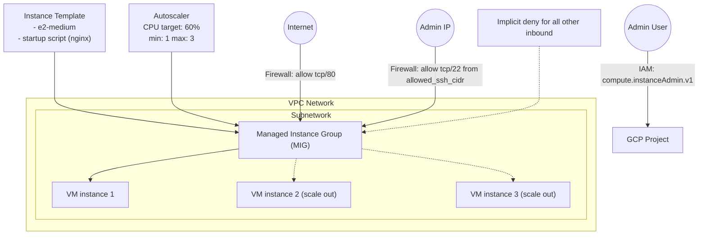

# Architecture Design

This diagram shows the setup you deploy with Terraform:
- A VPC + subnet
- Firewall rules (SSH restricted, HTTP allowed)
- Instance template → Managed Instance Group (MIG)
- Autoscaler based on average CPU utilization
- IAM binding for restricted admin access

## Diagram (Mermaid)

If you prefer, you can paste this Mermaid block into the report as well.
